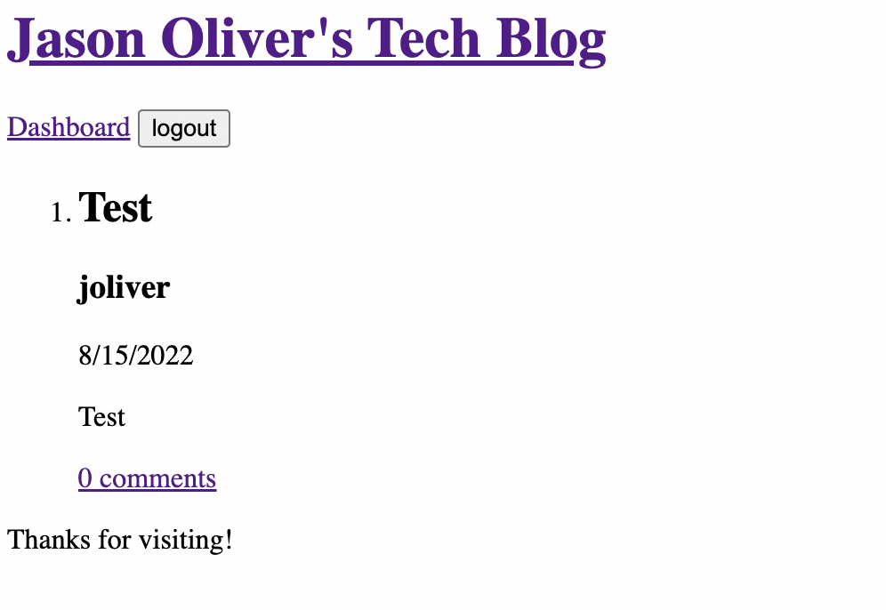

# Tech Blog

## Description

Tech blog is a page created to allow users to create accounts and login so they will be able to post and comment on posts. they can also edit and delete their posts from their user dashboard.

## How to Use Tech-Blog Back End App

To install clone the repository and open in vs code. Run npm install to install the dependencies, then using sql you can source the schema.sql. After that you can run the seeds. Finally you should be good to start up the server and checkout the site on localhost.

### Languages and Tools:

#  

## Heroku App for Tech Blog

-   [Tech Blog App](https://shrouded-mesa-54601.herokuapp.com/)

## GitHub repository for challenge 14

-   [Github Tech-Blog Repo](https://github.com/joliver521/Tech-Blog)
